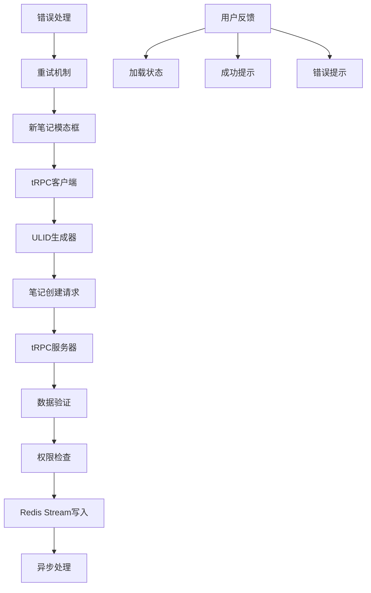

# 笔记创建功能设计文档

## 架构设计

### 系统架构图



### 数据流设计

#### 前端数据流

1. **用户输入** → 新笔记模态框收集用户输入的标题内容
2. **ID生成** → 使用ULID生成唯一笔记标识符
3. **数据组装** → 组装完整的笔记创建请求
4. **API调用** → 通过tRPC客户端发送请求到后端
5. **响应处理** → 处理成功/失败响应，更新UI状态

#### 后端数据流

1. **请求接收** → tRPC路由接收笔记创建请求
2. **数据验证** → 验证必需字段和数据格式
3. **权限检查** → 确认用户有创建笔记的权限
4. **Stream写入** → 将笔记数据写入Redis Stream
5. **响应返回** → 返回操作结果给前端

## 技术设计

### tRPC集成设计

#### 客户端配置

```typescript
// apps/client/src/lib/trpc.ts
import { createTRPCReact } from '@trpc/react-query'
import { type AppRouter } from '@noteum/server'

export const trpc = createTRPCReact<AppRouter>()

// 配置选项
const trpcClient = trpc.createClient({
  links: [
    httpBatchLink({
      url: '/api/trpc',
      // 添加认证头
      headers: () => ({
        Authorization: `Bearer ${getAuthToken()}`,
      }),
    }),
  ],
})
```

#### 类型安全设计

- 前端通过导入后端路由类型确保类型安全
- 编译时检查API调用的正确性
- 自动的TypeScript推断和补全

### ULID生成策略

#### 前端生成优势

1. **用户体验**: 无需等待服务器响应即可获得ID
2. **离线支持**: 支持离线创建笔记，稍后同步
3. **性能优化**: 减少网络往返次数
4. **时间排序**: ULID天然支持时间排序

#### 生成实现

```typescript
// apps/client/src/lib/ulid.ts
import { ulid } from 'ulid'

export function generateUlid(): string {
  return ulid()
}

export function validateUlid(id: string): boolean {
  const ulidRegex = /^[0123456789ABCDEFGHJKMNPQRSTVWXYZ]{26}$/i
  return ulidRegex.test(id)
}
```

### Redis Stream设计

#### Stream结构

```typescript
interface NoteStreamEntry {
  // Stream entry ID (自动生成)
  id: string

  // Fields
  noteId: string // 笔记唯一ID (ULID)
  title: string // 笔记标题
  notebookId: string // 笔记本ID
  createdBy: string // 创建者ID
  createdAt: string // 创建时间 (ISO)
  operation: 'CREATE' // 操作类型
}
```

#### Stream命名规范

- **Stream Key**: `notes:stream`
- **Consumer Group**: `note-processors`
- **Consumer Name**: `note-service-{instance-id}`

#### 写入实现

```typescript
async function addNoteToStream(noteData: CreateNoteRequest): Promise<string> {
  const streamId = await this.redis.xadd(
    'notes:stream',
    '*', // 自动生成stream ID
    {
      noteId: noteData.id,
      title: noteData.title,
      notebookId: noteData.notebookId,
      createdBy: noteData.createdBy,
      createdAt: new Date().toISOString(),
      operation: 'CREATE',
    }
  )
  return streamId
}
```

## 接口设计

### 前端接口

#### 笔记创建接口

```typescript
interface CreateNoteRequest {
  id: string // ULID生成的唯一ID
  title: string // 笔记标题
  notebookId: string // 笔记本ID，默认为'default'
}

interface CreateNoteResponse {
  success: boolean
  noteId: string
  streamId: string
  timestamp: string
}
```

#### UI状态接口

```typescript
interface NoteCreationState {
  isLoading: boolean
  error: string | null
  success: boolean
  lastCreatedNote: CreateNoteResponse | null
}
```

### 后端接口

#### tRPC路由定义

```typescript
export const notesRouter = t.router({
  create: t.procedure
    .input(
      z.object({
        id: z.string().ulid(),
        title: z.string().min(1).max(500),
        notebookId: z.string().default('default'),
      })
    )
    .mutation(async ({ input, ctx }) => {
      // 实现笔记创建逻辑
    }),
})
```

#### Redis Stream接口

```typescript
interface CacheService {
  xadd(
    stream: string,
    id: string,
    fields: Record<string, string>
  ): Promise<string>
  xread(
    stream: string,
    consumerGroup: string,
    consumerName: string
  ): Promise<any[]>
  xgroupCreate(stream: string, group: string, id: string): Promise<string>
}
```

## 错误处理设计

### 错误分类

1. **网络错误**: 连接超时、网络不可达
2. **验证错误**: 数据格式不正确、缺少必需字段
3. **权限错误**: 用户未认证、权限不足
4. **业务错误**: 重复ID、系统限制

### 错误处理策略

```typescript
// 重试策略
const retryStrategy = {
  maxRetries: 3,
  baseDelay: 1000,
  maxDelay: 5000,
  backoff: 'exponential' as const,
}

// 错误映射
const errorMap = {
  NETWORK_ERROR: '网络连接失败，请检查网络连接',
  VALIDATION_ERROR: '输入数据格式不正确',
  PERMISSION_ERROR: '您没有权限创建笔记',
  SYSTEM_ERROR: '系统错误，请稍后重试',
}
```

## 性能考虑

### 前端性能

- **ID生成**: ULID生成是纯计算操作，性能开销极小
- **请求优化**: 使用批量请求减少网络开销
- **状态管理**: 使用React状态管理，避免不必要的重渲染

### 后端性能

- **Redis性能**: Redis Stream写入是O(1)操作，性能优异
- **连接池**: 复用Redis连接，减少连接开销
- **异步处理**: Stream写入后立即返回，不阻塞用户操作

### 缓存策略

- **客户端缓存**: 缓存最近创建的笔记信息
- **Redis缓存**: 利用Redis的内存特性提供快速访问

## 安全考虑

### 数据验证

- **输入验证**: 严格验证所有用户输入
- **SQL注入防护**: 使用参数化查询
- **XSS防护**: 转义用户输入内容

### 权限控制

- **认证检查**: 验证用户身份
- **授权验证**: 确认用户有创建笔记权限
- **速率限制**: 防止恶意大量创建请求

### 数据保护

- **传输加密**: 使用HTTPS加密传输
- **敏感数据**: 避免在日志中记录敏感信息

## 监控和日志

### 关键指标

- **创建成功率**: 笔记创建操作的成功率
- **响应时间**: 创建操作的平均响应时间
- **错误率**: 各种错误类型的频率
- **并发量**: 同时处理创建操作的数量

### 日志记录

```typescript
// 结构化日志
logger.info('Note creation request', {
  noteId: noteData.id,
  userId: ctx.user.id,
  timestamp: new Date().toISOString(),
})

logger.error('Note creation failed', {
  noteId: noteData.id,
  userId: ctx.user.id,
  error: error.message,
  stack: error.stack,
})
```

## 测试策略

### 单元测试

- ULID生成函数测试
- 数据验证函数测试
- 错误处理逻辑测试

### 集成测试

- tRPC客户端-服务器集成测试
- Redis Stream读写测试
- 端到端创建流程测试

### 性能测试

- 并发创建测试
- 响应时间测试
- 错误恢复测试

## 部署考虑

### 环境变量

```bash
# tRPC配置
TRPC_URL=http://localhost:3000/api/trpc

# Redis配置
REDIS_HOST=localhost
REDIS_PORT=6379
REDIS_PASSWORD=
REDIS_DB=0

# 功能开关
ENABLE_NOTE_CREATION=true
ENABLE_RETRY=true
```

### 健康检查

- tRPC路由健康检查
- Redis连接健康检查
- 端到端功能检查

## 未来扩展

### 可能的扩展功能

1. **批量创建**: 支持一次创建多个笔记
2. **模板功能**: 基于模板创建笔记
3. **自动保存**: 草稿自动保存功能
4. **协作创建**: 多人协作创建笔记

### 扩展设计考虑

- 保持API向后兼容
- 模块化设计支持功能扩展
- 性能优化支持更大规模
