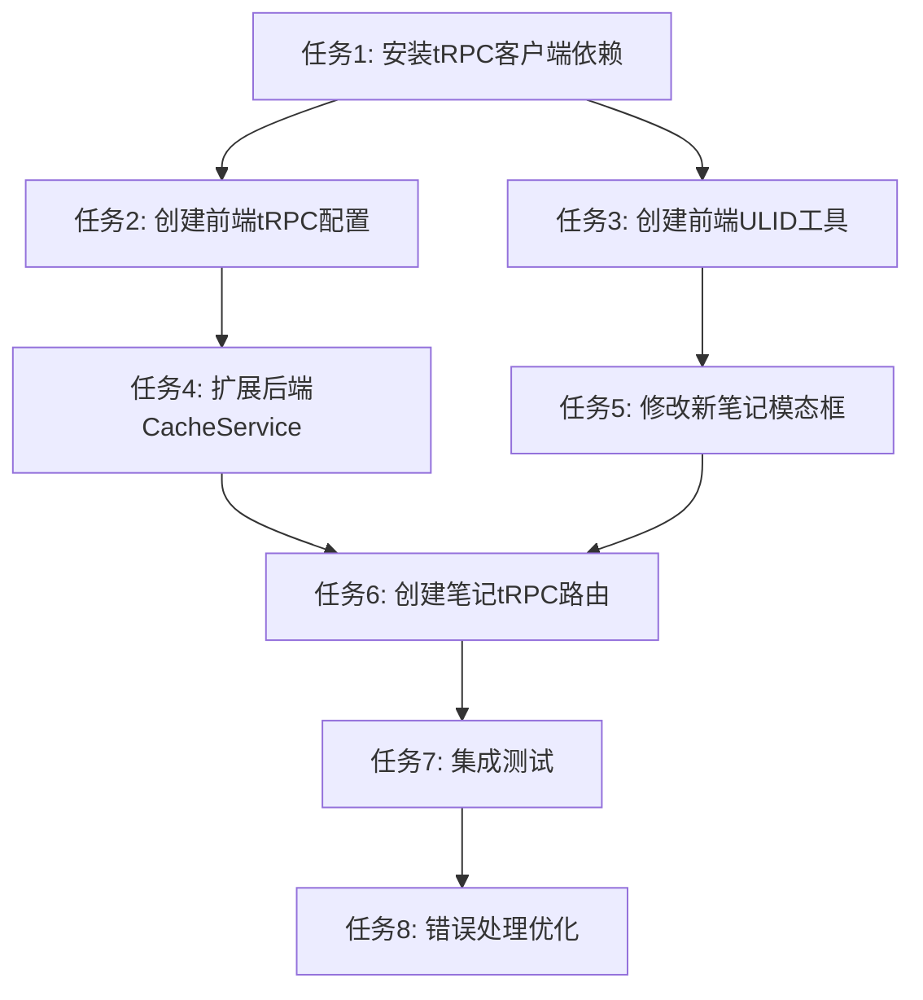

# 笔记创建功能实施任务列表

## 任务依赖关系

## 详细任务列表

### 任务1: 安装和配置tRPC客户端依赖

**优先级**: 高
**预估时间**: 30分钟
**依赖**: 无

**子任务**:

- [ ] 在apps/client/package.json中添加@trpc/client依赖
- [ ] 添加@trpc/react-query相关依赖（如果需要）
- [ ] 验证依赖安装成功

**验收标准**:

- tRPC客户端依赖成功安装
- 无版本冲突警告

### 任务2: 创建前端tRPC配置和类型定义

**优先级**: 高
**预估时间**: 45分钟
**依赖**: 任务1

**子任务**:

- [ ] 创建apps/client/src/lib/trpc.ts配置文件
- [ ] 设置tRPC客户端基础配置
- [ ] 创建类型定义文件，引用后端路由类型
- [ ] 配置tRPC Provider在应用根部

**验收标准**:

- tRPC客户端配置完成
- 类型定义正确导入
- 应用能够正常启动

### 任务3: 创建前端ULID工具函数

**优先级**: 高
**预估时间**: 30分钟
**依赖**: 任务1

**子任务**:

- [ ] 安装ulid依赖到客户端
- [ ] 创建apps/client/src/lib/ulid.ts工具函数
- [ ] 实现generateUlid函数
- [ ] 添加单元测试

**验收标准**:

- ULID生成函数正常工作
- 生成的ID符合ULID标准
- 测试通过

### 任务4: 扩展后端CacheService支持Redis Stream

**优先级**: 高
**预估时间**: 60分钟
**依赖**: 无

**子任务**:

- [ ] 在CacheService中添加xadd方法
- [ ] 添加xread方法（可选，用于测试）
- [ ] 创建Redis Stream操作的工具函数
- [ ] 添加错误处理和重试逻辑

**验收标准**:

- Redis Stream操作方法正常工作
- 错误处理完善
- 可以成功写入测试数据

### 任务5: 修改新笔记模态框集成tRPC调用

**优先级**: 高
**预估时间**: 45分钟
**依赖**: 任务2, 任务3

**子任务**:

- [ ] 修改new-note-modal.tsx导入tRPC客户端
- [ ] 添加ULID生成逻辑
- [ ] 修改handleCreateNote函数调用tRPC接口
- [ ] 添加加载状态和错误处理
- [ ] 保持现有键盘快捷键功能

**验收标准**:

- 模态框能够调用tRPC接口
- 成功时正确关闭和重置
- 失败时显示错误信息
- 键盘快捷键正常工作

### 任务6: 创建笔记创建tRPC路由

**优先级**: 高
**预估时间**: 90分钟
**依赖**: 任务4

**子任务**:

- [ ] 在trpc.router.ts中添加notes路由
- [ ] 创建notes.create mutation
- [ ] 实现输入数据验证（zod schema）
- [ ] 集成CacheService Stream写入
- [ ] 添加用户权限检查
- [ ] 实现错误处理和响应格式化

**验收标准**:

- tRPC路由正确响应
- 数据验证工作正常
- 笔记数据成功写入Redis Stream
- 权限检查有效

### 任务7: 集成测试和验证

**优先级**: 中
**预估时间**: 60分钟
**依赖**: 任务5, 任务6

**子任务**:

- [ ] 启动开发环境（前端和后端）
- [ ] 测试完整的笔记创建流程
- [ ] 验证Redis Stream数据格式
- [ ] 测试错误场景（网络错误、验证失败等）
- [ ] 验证用户体验（加载状态、错误提示）

**验收标准**:

- 端到端流程正常工作
- Redis Stream包含正确格式的数据
- 错误场景处理正确
- 用户体验良好

### 任务8: 错误处理和用户体验优化

**优先级**: 中
**预估时间**: 45分钟
**依赖**: 任务7

**子任务**:

- [ ] 实现网络错误重试机制
- [ ] 优化错误消息显示
- [ ] 添加操作成功反馈
- [ ] 实现表单验证和提示
- [ ] 添加操作日志记录

**验收标准**:

- 网络错误时自动重试
- 错误消息清晰易懂
- 成功操作有明确反馈
- 表单验证及时准确

### 任务9: 代码质量保证

**优先级**: 中
**预估时间**: 30分钟
**依赖**: 任务8

**子任务**:

- [ ] 运行代码检查和格式化
- [ ] 添加类型检查
- [ ] 更新相关文档
- [ ] 进行代码审查

**验收标准**:

- 无linting错误
- TypeScript类型检查通过
- 代码风格一致
- 文档更新完整

## 风险和缓解措施

### 技术风险

1. **tRPC版本兼容性**: 确保前后端tRPC版本匹配
2. **Redis Stream权限**: 验证Redis实例支持Stream操作
3. **类型同步**: 确保前后端类型定义保持同步

### 缓解措施

- 在开发过程中频繁测试集成
- 备份现有配置，支持快速回滚
- 建立清晰的错误监控和日志记录

## 时间估算总结

- **总预估时间**: 7.5小时
- **关键路径**: 任务1 → 任务2 → 任务5 → 任务6 → 任务7
- **可并行任务**: 任务3和任务4可以并行开发
- **缓冲时间**: 预留1小时用于意外问题和调试

## 完成标准

项目完成时应该能够：

1. 用户在新笔记模态框输入内容
2. 点击创建按钮或使用快捷键提交
3. 系统生成ULID ID并调用tRPC接口
4. 后端验证数据并写入Redis Stream
5. 前端显示操作结果（成功/失败）
6. 整个流程响应迅速，错误处理完善
