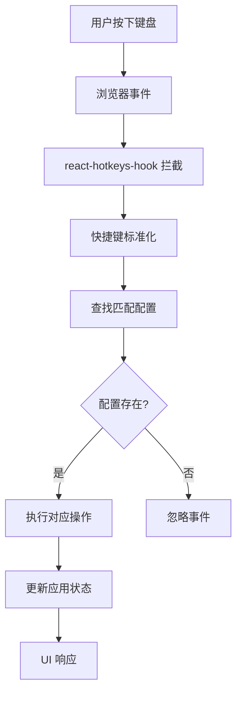
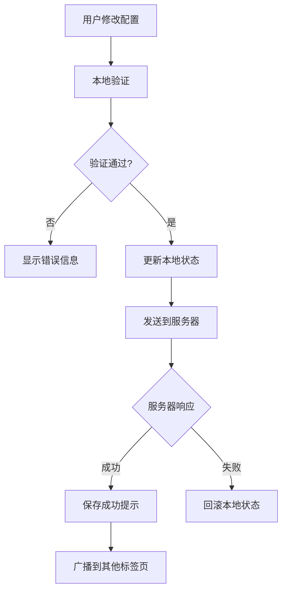

# 设计文档：全局快捷键系统

## 架构设计

### 系统概述

全局快捷键系统采用分层架构设计，包含以下核心组件：

```
┌─────────────────────────────────────────────────────────┐
│                    应用层 (App Layer)                    │
├─────────────────────────────────────────────────────────┤
│  Today Page  │  Settings Page  │  Modal Components     │
├─────────────────────────────────────────────────────────┤
│                   快捷键管理层 (Shortcut Layer)           │
├─────────────────────────────────────────────────────────┤
│ ShortcutProvider │ ShortcutManager │ ShortcutHooks     │
├─────────────────────────────────────────────────────────┤
│                   状态管理层 (State Layer)                │
├─────────────────────────────────────────────────────────┤
│   Zustand Store   │   React Context   │   Local Cache   │
├─────────────────────────────────────────────────────────┤
│                   数据层 (Data Layer)                     │
├─────────────────────────────────────────────────────────┤
│   Backend API     │   Database        │   Browser APIs  │
└─────────────────────────────────────────────────────────┘
```

### 核心组件设计

#### 1. ShortcutProvider (全局提供者)

```typescript
interface ShortcutProviderProps {
  children: React.ReactNode
  userId: string
  initialConfig?: ShortcutConfig[]
}

// 提供全局快捷键上下文
export const ShortcutProvider: React.FC<ShortcutProviderProps>
```

**职责**:

- 初始化快捷键系统
- 提供全局快捷键上下文
- 管理快捷键监听器的生命周期
- 处理配置的加载和保存

#### 2. ShortcutManager (快捷键管理器)

```typescript
interface ShortcutManager {
  // 注册快捷键
  register(config: ShortcutConfig): void

  // 注销快捷键
  unregister(id: string): void

  // 更新快捷键配置
  update(id: string, config: Partial<ShortcutConfig>): void

  // 检测快捷键冲突
  detectConflict(config: ShortcutConfig): ShortcutConfig | null

  // 获取所有快捷键
  getAll(): ShortcutConfig[]

  // 启用/禁用快捷键
  toggle(id: string, enabled: boolean): void
}
```

**职责**:

- 管理快捷键的注册和注销
- 处理快捷键冲突检测
- 提供快捷键配置的 CRUD 操作
- 维护快捷键状态

#### 3. 快捷键监听系统

基于 `react-hotkeys-hook` 实现，支持跨平台快捷键处理：

```typescript
// 快捷键标准化
const normalizeKey = (key: string, platform: Platform): string => {
  // 处理平台差异
  if (platform === 'mac' && key === 'meta') return 'cmd'
  if (platform === 'windows' && key === 'meta') return 'ctrl'
  return key.toLowerCase()
}

// 快捷键组合生成
const generateHotkey = (config: ShortcutConfig): string => {
  const modifiers = config.modifiers.join('+')
  const key = config.key.toLowerCase()
  return `${modifiers}+${key}`
}
```

## 技术选型

### 核心依赖

| 库名称                 | 版本   | 用途       | 选择理由                       |
| ---------------------- | ------ | ---------- | ------------------------------ |
| react-hotkeys-hook     | ^4.4.1 | 快捷键监听 | React 专用，性能优秀，API 简洁 |
| is-hotkey              | ^0.2.0 | 快捷键匹配 | 轻量级，支持复杂组合键         |
| zustand                | ^4.4.1 | 状态管理   | 项目已使用，保持一致性         |
| @radix-ui/react-dialog | ^1.0.5 | 模态框组件 | 项目已集成，无需额外依赖       |

### 备选方案

#### 快捷键监听库备选

- **mousetrap**: 功能强大，但体积较大
- **hotkeys-js**: 轻量级，但 React 集成不够友好
- **自研实现**: 灵活性高，但开发成本大

选择 `react-hotkeys-hook` 的原因：

- React Hooks 原生支持
- 性能优化做得很好
- 支持依赖数组，避免不必要的重渲染
- TypeScript 支持完善

## 数据流设计

### 快捷键触发流程



### 配置同步流程



## 组件设计

### 1. Today 页面组件

```typescript
// pages/today.tsx
export const TodayPage: React.FC = () => {
  const { user } = useAuth()
  const { shortcuts, isLoading } = useShortcuts()

  return (
    <div className="h-screen w-full bg-background">
      {/* 快捷键提示 */}
      <KeyboardShortcutsHelp />

      {/* 主要内容区域 */}
      <main className="h-full flex items-center justify-center">
        <div className="text-center">
          <h1 className="text-2xl font-semibold mb-4">
            欢迎回来，{user?.displayName}
          </h1>
          <p className="text-muted-foreground">
            按 <kbd className="px-2 py-1 bg-muted rounded">Cmd+N</kbd> 创建新笔记
          </p>
        </div>
      </main>
    </div>
  )
}
```

### 2. 新建笔记模态框

```typescript
// components/modals/new-note-modal.tsx
interface NewNoteModalProps {
  isOpen: boolean
  onClose: () => void
  onCreateNote: (data: CreateNoteData) => void
}

export const NewNoteModal: React.FC<NewNoteModalProps> = ({
  isOpen,
  onClose,
  onCreateNote
}) => {
  const [title, setTitle] = useState('')
  const [notebookId, setNotebookId] = useState('')

  return (
    <Dialog open={isOpen} onOpenChange={onClose}>
      <DialogContent size="md">
        <DialogHeader>
          <DialogTitle>创建新笔记</DialogTitle>
          <DialogDescription>
            选择笔记本并为新笔记命名
          </DialogDescription>
        </DialogHeader>

        <div className="space-y-4">
          <div>
            <Label htmlFor="notebook">笔记本</Label>
            <Select value={notebookId} onValueChange={setNotebookId}>
              {/* 笔记本选项 */}
            </Select>
          </div>

          <div>
            <Label htmlFor="title">标题</Label>
            <Input
              id="title"
              value={title}
              onChange={(e) => setTitle(e.target.value)}
              placeholder="输入笔记标题..."
            />
          </div>
        </div>

        <DialogFooter>
          <Button variant="outline" onClick={onClose}>
            取消
          </Button>
          <Button onClick={() => onCreateNote({ title, notebookId })}>
            创建笔记
          </Button>
        </DialogFooter>
      </DialogContent>
    </Dialog>
  )
}
```

### 3. 快捷键配置组件

```typescript
// components/shortcuts/shortcut-editor.tsx
interface ShortcutEditorProps {
  shortcut: ShortcutConfig
  onChange: (config: ShortcutConfig) => void
  onRemove: () => void
}

export const ShortcutEditor: React.FC<ShortcutEditorProps> = ({
  shortcut,
  onChange,
  onRemove
}) => {
  const [isRecording, setIsRecording] = useState(false)

  return (
    <div className="flex items-center space-x-4">
      <div className="flex-1">
        <Label>快捷键</Label>
        <ShortcutRecorder
          value={shortcut}
          onRecord={onChange}
          isRecording={isRecording}
          onStartRecord={() => setIsRecording(true)}
          onStopRecord={() => setIsRecording(false)}
        />
      </div>

      <div className="flex-1">
        <Label>操作</Label>
        <Select
          value={shortcut.action}
          onValueChange={(action) => onChange({ ...shortcut, action })}
        >
          {/* 操作选项 */}
        </Select>
      </div>

      <div className="flex items-center space-x-2">
        <Switch
          checked={shortcut.enabled}
          onCheckedChange={(enabled) => onChange({ ...shortcut, enabled })}
        />
        <Button variant="ghost" size="sm" onClick={onRemove}>
          删除
        </Button>
      </div>
    </div>
  )
}
```

## 状态管理设计

### Zustand Store 结构

```typescript
// stores/shortcuts.ts
interface ShortcutsState {
  // 状态
  shortcuts: Record<string, ShortcutConfig>
  isLoading: boolean
  error: string | null
  activeModal: string | null

  // 操作
  loadShortcuts: () => Promise<void>
  saveShortcuts: (shortcuts: Record<string, ShortcutConfig>) => Promise<void>
  addShortcut: (config: ShortcutConfig) => void
  updateShortcut: (id: string, config: Partial<ShortcutConfig>) => void
  removeShortcut: (id: string) => void
  openModal: (modalId: string) => void
  closeModal: () => void

  // 工具方法
  detectConflict: (config: ShortcutConfig) => ShortcutConfig | null
  normalizeShortcut: (config: ShortcutConfig) => ShortcutConfig
}

export const useShortcutsStore = create<ShortcutsState>()(
  devtools(
    persist(
      (set, get) => ({
        // 初始状态
        shortcuts: {},
        isLoading: false,
        error: null,
        activeModal: null,

        // 实现方法...
      }),
      {
        name: 'shortcuts-store',
        partialize: (state) => ({
          shortcuts: state.shortcuts,
        }),
      }
    )
  )
)
```

### React Hooks 设计

```typescript
// hooks/use-shortcuts.ts
export const useShortcuts = () => {
  const store = useShortcutsStore()

  // 自动注册快捷键
  useEffect(() => {
    Object.entries(store.shortcuts).forEach(([id, config]) => {
      if (config.enabled) {
        registerHotkey(config.key, config.modifiers, () => {
          executeShortcutAction(config.action)
        })
      }
    })

    return () => {
      // 清理监听器
      unregisterAllHotkeys()
    }
  }, [store.shortcuts])

  return store
}

// hooks/use-shortcut.ts
export const useShortcut = (action: string) => {
  const { shortcuts } = useShortcuts()

  const shortcut = Object.values(shortcuts).find((s) => s.action === action)

  return {
    shortcut,
    bindShortcut: () => ({
      'data-hotkey': shortcut ? generateHotkey(shortcut) : undefined,
      title: shortcut
        ? `${shortcut.description} (${formatShortcut(shortcut)})`
        : undefined,
    }),
  }
}
```

## 数据库设计

### Schema 变更

```sql
-- 扩展用户偏好设置表
ALTER TABLE user_profiles
ADD COLUMN shortcuts JSON DEFAULT '{}';

-- 默认快捷键配置
UPDATE user_profiles
SET shortcuts = '{
  "version": "1.0.0",
  "shortcuts": [
    {
      "id": "new-note",
      "key": "n",
      "modifiers": ["meta"],
      "action": "openNewNoteModal",
      "description": "新建笔记",
      "enabled": true
    }
  ],
  "presets": ["default"]
}'
WHERE shortcuts = '{}';
```

### API 设计

```typescript
// API 端点设计
GET    /api/user/shortcuts     // 获取用户快捷键配置
PUT    /api/user/shortcuts     // 更新快捷键配置
POST   /api/user/shortcuts     // 添加快捷键配置
DELETE /api/user/shortcuts/:id // 删除快捷键配置
GET    /api/user/shortcuts/presets // 获取预设方案

// 请求/响应类型
interface ShortcutConfigRequest {
  key: string
  modifiers: string[]
  action: string
  description?: string
  enabled: boolean
}

interface ShortcutConfigResponse extends ShortcutConfigRequest {
  id: string
  createdAt: string
  updatedAt: string
}
```

## 性能优化策略

### 1. 快捷键监听优化

```typescript
// 使用防抖避免频繁触发
const debouncedHandler = useMemo(
  () =>
    debounce((event: KeyboardEvent) => {
      // 处理快捷键逻辑
    }, 16), // 60fps
  []
)

// 条件性监听器注册
const listeners = useMemo(() => {
  return Object.values(shortcuts)
    .filter((config) => config.enabled)
    .map((config) => createListener(config))
}, [shortcuts])
```

### 2. 配置缓存策略

```typescript
// 多层缓存
const cacheStrategy = {
  // 内存缓存 (会话级别)
  memory: new Map<string, ShortcutConfig>(),

  // 本地存储 (持久化)
  localStorage: {
    key: 'user-shortcuts-cache',
    ttl: 24 * 60 * 60 * 1000, // 24小时
  },

  // 远程缓存 (数据库)
  remote: {
    endpoint: '/api/user/shortcuts',
    syncInterval: 5 * 60 * 1000, // 5分钟
  },
}
```

### 3. 懒加载优化

```typescript
// 模态框懒加载
const NewNoteModal = lazy(() => import('./components/modals/new-note-modal'))

// 快捷键配置页面懒加载
const ShortcutsSettings = lazy(() => import('./pages/shortcuts-settings'))
```

## 测试策略

### 1. 单元测试

```typescript
// tests/shortcuts.test.ts
describe('ShortcutManager', () => {
  test('应该正确注册快捷键', () => {
    const manager = new ShortcutManager()
    const config = createMockShortcutConfig()

    manager.register(config)

    expect(manager.getAll()).toContain(config)
  })

  test('应该检测快捷键冲突', () => {
    const manager = new ShortcutManager()
    const config1 = createMockShortcutConfig({ key: 'n', modifiers: ['meta'] })
    const config2 = createMockShortcutConfig({ key: 'n', modifiers: ['meta'] })

    manager.register(config1)
    const conflict = manager.detectConflict(config2)

    expect(conflict).toBe(config1)
  })
})
```

### 2. 集成测试

```typescript
// tests/integration/shortcuts.test.ts
describe('快捷键系统集成测试', () => {
  test('应该完整执行快捷键流程', async () => {
    render(
      <ShortcutProvider>
        <TodayPage />
      </ShortcutProvider>
    )

    // 模拟按下 Command+N
    fireEvent.keyDown(window, { key: 'n', metaKey: true })

    // 验证模态框打开
    await waitFor(() => {
      expect(screen.getByRole('dialog')).toBeInTheDocument()
    })
  })
})
```

### 3. E2E 测试

```typescript
// tests/e2e/shortcuts.spec.ts
test('用户可以使用快捷键创建笔记', async ({ page }) => {
  await page.goto('/today')

  // 按下快捷键
  await page.keyboard.press('Meta+n')

  // 验证模态框出现
  await expect(page.locator('[role="dialog"]')).toBeVisible()

  // 填写表单
  await page.fill('[data-testid="note-title"]', '测试笔记')
  await page.click('[data-testid="create-button"]')

  // 验证笔记创建成功
  await expect(page.locator('[data-testid="success-message"]')).toBeVisible()
})
```

## 安全考虑

### 1. 输入验证

```typescript
// 快捷键配置验证
const validateShortcutConfig = (config: ShortcutConfig): ValidationResult => {
  const errors: string[] = []

  // 验证按键有效性
  if (!isValidKey(config.key)) {
    errors.push('无效的按键')
  }

  // 验证修饰键组合
  if (!isValidModifierCombo(config.modifiers)) {
    errors.push('无效的修饰键组合')
  }

  // 验证操作存在性
  if (!isValidAction(config.action)) {
    errors.push('无效的操作')
  }

  return {
    isValid: errors.length === 0,
    errors,
  }
}
```

### 2. XSS 防护

```typescript
// 转义用户输入
const escapeHtml = (text: string): string => {
  return text
    .replace(/&/g, '&amp;')
    .replace(/</g, '&lt;')
    .replace(/>/g, '&gt;')
    .replace(/"/g, '&quot;')
    .replace(/'/g, '&#x27;')
}
```

### 3. 权限控制

```typescript
// 快捷键权限检查
const checkShortcutPermission = (action: string, user: User): boolean => {
  const requiredPermissions = getActionPermissions(action)
  return user.permissions.some((p) => requiredPermissions.includes(p))
}
```

## 可访问性设计

### 1. 键盘导航支持

```typescript
// 焦点管理
const useFocusManagement = () => {
  const trapFocus = (container: HTMLElement) => {
    const focusableElements = container.querySelectorAll(
      'button, [href], input, select, textarea, [tabindex]:not([tabindex="-1"])'
    )

    const firstElement = focusableElements[0] as HTMLElement
    const lastElement = focusableElements[
      focusableElements.length - 1
    ] as HTMLElement

    // 实现焦点循环
  }

  return { trapFocus }
}
```

### 2. 屏幕阅读器支持

```typescript
// ARIA 标签和说明
const ShortcutHelp = ({ shortcut }: { shortcut: ShortcutConfig }) => (
  <div
    role="tooltip"
    aria-label={`快捷键：${formatShortcut(shortcut)}`}
    aria-describedby="shortcut-help"
  >
    <kbd>{formatShortcut(shortcut)}</kbd>
    <span id="shortcut-help">{shortcut.description}</span>
  </div>
)
```

## 部署和监控

### 1. 配置管理

```typescript
// 环境配置
const shortcutConfig = {
  development: {
    enableDebugMode: true,
    logLevel: 'debug',
  },
  production: {
    enableDebugMode: false,
    logLevel: 'error',
  },
}
```

### 2. 性能监控

```typescript
// 快捷键性能指标
const trackShortcutPerformance = (action: string, duration: number) => {
  // 发送到监控系统
  analytics.track('shortcut_performance', {
    action,
    duration,
    timestamp: Date.now(),
  })
}
```

### 3. 错误监控

```typescript
// 快捷键错误捕获
const handleShortcutError = (error: Error, config: ShortcutConfig) => {
  console.error(`快捷键错误 [${config.action}]:`, error)

  // 发送错误报告
  errorReporting.captureException(error, {
    tags: {
      component: 'shortcuts',
      action: config.action,
    },
    extra: {
      config,
    },
  })
}
```

这个设计文档提供了全局快捷键系统的完整技术架构，包括组件设计、数据流、性能优化、安全考虑等各个方面，为后续的实现提供了详细的指导。
